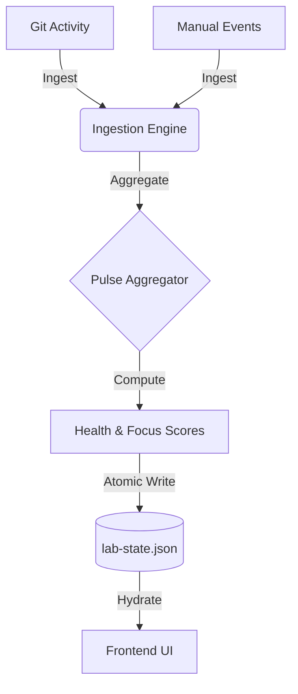

# ASR Lab 🧪

> **"Systems thinker. Projects evolve over time. Decisions matter more than static showcases."**

ASR Lab is not a traditional portfolio. It is a **living digital laboratory** that visualizes the evolution of my work through data. Instead of static project cards, it tracks **decisions, shipping velocity, and project health** in real-time.


[](https://asr-labs.vercel.app/)

---

## 🏗 Architecture

The system is built on a **Single Source of Truth** philosophy. All logic—ingestion, aggregation, and scoring—happens offline to generate a deterministic snapshot (`lab-state.json`) that drives the frontend.



### Core Components

1.  **Ingestion Pipeline** (`/backend`)
    *   **Pulse Aggregator**: Filters git noise to extract meaningful work signals.
    *   **Focus Engine**: Mathematically calculates "Current Focus" using inertia and decay algorithms.
    *   **Health Calculator**: Assigns dynamic health scores (0-100) based on stability, shipping frequency, and decision velocity.
    *   **Atomic Writer**: Ensures data integrity with rigid validation before state updates.

2.  **Living Interface** (`/frontend`)
    *   **Visualizing Flux**: Projects breathe; they aren't static. The UI reflects activity through pulse animations and timeline feeds.
    *   **Decision Logs**: First-class support for documenting *why* a choice was made, not just *what* was built.
    *   **Tech**: Built with **Vite**, **React**, and **Tailwind CSS v4**.

---

## 🚀 Getting Started

### Prerequisites
- Node.js (v18+)
- npm

### Installation

```bash
# Clone the laboratory
git clone https://github.com/Ashurai84/ASR_LABS.git
cd ASR_LABS

# Install backend dependencies
cd backend
npm install

# Install frontend dependencies
cd ../frontend
npm install
```

### Running the System

**1. Ingest Data (The Heartbeat)**
Update the state by analyzing git history and timeline events.

```bash
cd backend
npm run ingest
```
*Output: Generates `backend/state/lab-state.json`*

**2. Launch the Interface**
Visualize the laboratory.

```bash
cd frontend
npm run dev
```
*Access at `http://localhost:5173`*

---

## 🧬 Data Model

The entire state of the lab is contained in a single, portable JSON schema:

```typescript
interface LabState {
  meta: {
    version: string;
    system_health: 'operational' | 'degraded';
  };
  projects: Project[]; // The registry of work
  derived: {
    current_focus_project_id: string; // Calculated focus
    global_health: number;
  };
  timeline_events: Record<UUID, Event>; // The history log
}
```

---

## 🛠 Tech Stack

*   **Runtime**: Node.js & TypeScript
*   **Build System**: Vite
*   **Styling**: Tailwind CSS v4 (using `@tailwindcss/vite`)
*   **Icons**: Lucide React
*   **Animation**: Framer Motion
*   **Git Operations**: simple-git

---

© 2026 Ashutosh Rai. Built for the long term.
